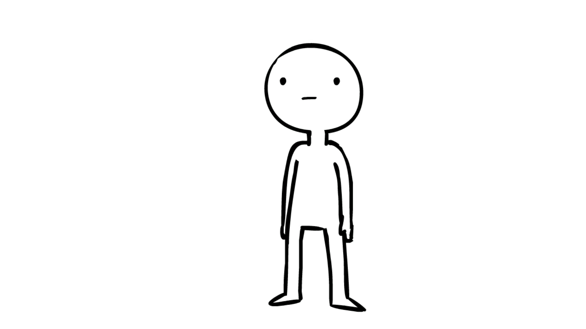

# The "Useless Knowledge" Trivia Game

Welcome to the "Useless Knowledge" Trivia game, the only trivia game mentioned in this README! 

The "Useless Knowledge" Trivia Game is not for all ages. Some of the content in this game is insuitable for anyone who shouldn't watch an "R" rated movie. 

The goal of this game is to put at least one strange tidbit in the user's mind, thereby eliminating yet another tiny portion of precious brain-space.

To start press the start button and the first question will appear along with a timer. You have one shot at clicking an answer before the timer runs out. At the end you'll see how you did. 

If you need any assistance or just have general questions speak them aloud, as that will be about as effective as this knowledge is.

 